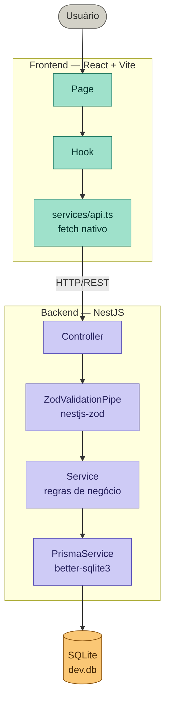
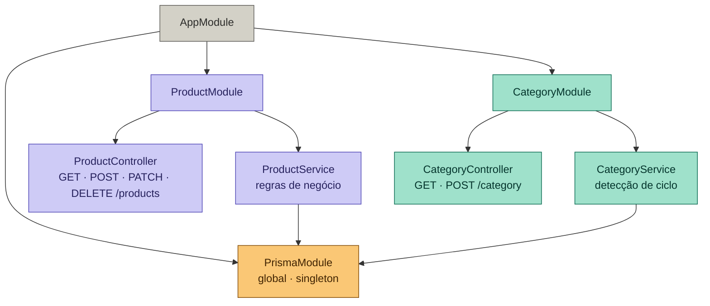
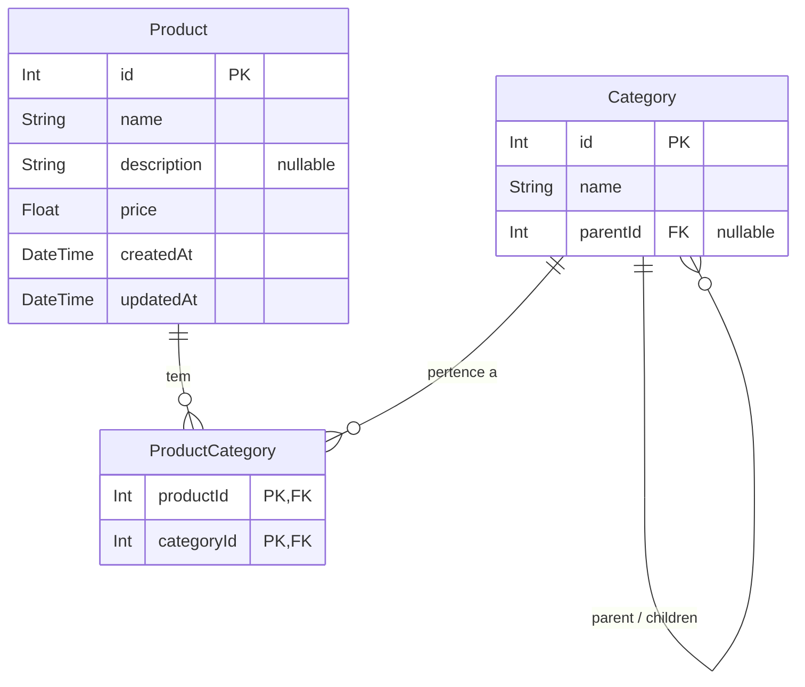

# 📦 Product Manager

Aplicação fullstack para gerenciamento de produtos e categorias, desenvolvida com foco em **qualidade de código, arquitetura escalável e boas práticas de engenharia de software**.

O projeto demonstra separação clara de responsabilidades, validação robusta com Zod, testes automatizados e containerização com Docker.

Stack: **NestJS + Prisma 7 + SQLite (better-sqlite3)** no backend, **React + Vite + Tailwind** no frontend.

---

## Sumário

- [Requisitos](#requisitos)
- [Instalação e execução](#instalação-e-execução)
  - [Sem Docker (desenvolvimento local)](#sem-docker-desenvolvimento-local)
  - [Com Docker](#com-docker)
- [Estrutura do projeto](#estrutura-do-projeto)
- [Funcionalidades](#funcionalidades)
- [Arquitetura](#arquitetura)
- [Decisões técnicas](#decisões-técnicas)
- [Uso de Inteligência Artificial](#uso-de-inteligência-artificial)
- [Testes](#testes)

---

## Requisitos

- **Node.js** ≥ 20
- **npm** ≥ 10
- **Docker** e **Docker Compose** (opcional)

---

## Instalação e execução

### Sem Docker (desenvolvimento local)

```bash
# 1. Clone o repositório
git clone https://github.com/hltav/coderlab_test
cd product-manager

# 2. Instale as dependências (workspaces)
npm install

# 3. Execute as migrations do banco de dados
npm run db:migrate

# 4. Inicie backend e frontend simultaneamente
npm run dev
```

| Serviço  | URL                     |
| -------- | ----------------------- |
| Frontend | <http://localhost:5173> |
| Backend  | <http://localhost:3000> |

---

### Com Docker

```bash
# Build e inicialização de todos os serviços
docker compose up --build
```

> O `docker-compose.yml` na raiz do projeto orquestra os containers de backend e frontend.  
> As migrations são executadas automaticamente no start do container do backend.

| Serviço  | URL                     |
| -------- | ----------------------- |
| Frontend | <http://localhost:5173> |
| Backend  | <http://localhost:3000> |

---

## Estrutura do projeto

```
product-manager/               ← Monorepo (npm workspaces)
├── apps/
│   ├── backend/               ← NestJS API
│   │   ├── prisma/            ← Schema e migrations
│   │   └── src/
│   │       ├── modules/
│   │       │   ├── product/   ← Controller, Service, DTOs
│   │       │   └── category/  ← Controller, Service, DTOs
│   │       ├── prisma/        ← PrismaModule + PrismaService
│   │       └── common/        ← Filtros e utilitários globais
│   └── frontend/              ← React + Vite
│       └── src/
│           ├── pages/         ← MainPage, ProductForm, Modais
│           ├── hooks/         ← useProducts, useCategories
│           ├── services/      ← api.ts (fetch nativo)
│           └── components/    ← DTOs, interfaces, UI
├── docker/                    ← Dockerfiles separados por app
├── docker-compose.yml
└── package.json               ← Scripts globais + workspaces
```

---

## Funcionalidades

### Backend — Endpoints disponíveis

#### Categorias

| Método | Rota        | Descrição                 |
| ------ | ----------- | ------------------------- |
| GET    | /categories | Lista todas as categorias |
| POST   | /categories | Cria nova categoria       |

> Toda validação usa `nestjs-zod` com `ZodValidationPipe`. Categorias aplicam o pipe por rota via `@UsePipes`; produtos via pipe global configurado no `main.ts`.

#### Produtos

| Método | Rota          | Descrição                            |
| ------ | ------------- | ------------------------------------ |
| GET    | /products     | Lista produtos (filtro por `?name=`) |
| GET    | /products/:id | Busca produto por ID (`id`: number)  |
| POST   | /products     | Cria novo produto                    |
| PATCH  | /products/:id | Atualiza produto parcialmente        |
| DELETE | /products/:id | Remove produto                       |

#### Regras de negócio

- **Produto deve ter ao menos uma categoria** — validado no schema Zod com `.min(1)` no array `categoryIds`, tanto na criação quanto na atualização (via `.refine()` no `UpdateProductSchema`).
- **Preço não pode ser negativo** — validado no schema Zod com `z.number().min(0)`.
- **Categoria não pode ter loop de hierarquia** — ao criar uma categoria com `parentId`, o service percorre a árvore de ancestrais e rejeita se encontrar ciclo.

### Frontend

- Listagem de produtos em tabela responsiva
- Filtro por nome em tempo real
- Modal de criação e edição de produto (com seleção de categorias)
- Modal de criação de categorias
- Exclusão de produto com confirmação
- Notificações de feedback (sucesso/erro)
- Layout responsivo com Tailwind CSS

---

## Arquitetura

### Fluxo de uma requisição



### Organização de módulos — Backend



### Modelo de dados



## Decisões técnicas

### ORM: Prisma

O Prisma foi escolhido pelos seguintes motivos:

- **Prisma 7 com gerador customizado**:o projeto usa provider = "prisma-client" com output = "../src/generated", aproveitando o novo gerador standalone do Prisma 7 que não depende de @prisma/client como pacote separado. O client gerado fica versionado junto ao código, o que facilita o build em containers.
- **Type safety end-to-end**: o Prisma Client é gerado a partir do schema, o que garante que qualquer alteração no banco seja refletida imediatamente no código TypeScript com erros em tempo de compilação — eliminando uma categoria inteira de bugs de runtime.
- **Migrations declarativas**: o workflow `prisma migrate dev` gera SQL versionado e auditável automaticamente, sem necessidade de escrita manual de migrations.
- **DX superior**: a sintaxe do Prisma é mais próxima do domínio do problema do que a do TypeORM. `findMany({ where: { name: { contains: q } } })` é mais legível do que um QueryBuilder encadeado.
- **Integração com NestJS**: o PrismaService estende PrismaClient (gerado em src/generated/client) e implementa OnModuleInit/OnModuleDestroy, chamando $connect() e $disconnect() nos respectivos hooks do ciclo de vida do módulo. O adapter PrismaBetterSqlite3 é instanciado no construtor, recebendo o caminho do banco via variável de ambiente.
- **Banco de dados**: SQLite via better-sqlite3 (driver nativo síncrono) com o adapter PrismaBetterSqlite3. A URL do banco é injetada programaticamente no construtor do PrismaService via process.env['DATABASE_PATH'], com fallback para ./prisma/dev.db — por isso o datasource no schema.prisma não precisa de url = env(...). A troca para PostgreSQL/MySQL em produção exige trocar o adapter e ajustar o schema.prisma.

**Tradeoffs considerados**: três ORMs foram avaliados:

- **TypeORM** — maior maturidade no ecossistema NestJS e suporte nativo a Active Record e Data Mapper. Porém, a geração de tipos é menos precisa (usa decorators em runtime) e o QueryBuilder verboso aumenta o custo de manutenção em queries complexas.
- **Drizzle** — excelente type safety com SQL explícito, bundle leve e sem geração de código. É uma escolha sólida para quem prefere controle total sobre as queries. A desvantagem para este projeto é a ausência de um sistema de migrations tão maduro quanto o do Prisma e a menor quantidade de exemplos com NestJS, o que aumentaria o tempo de setup.
- **Prisma** _(escolhido)_ — melhor equilíbrio entre produtividade, type safety e ferramental: schema declarativo como fonte única de verdade, migrations versionadas automaticamente, e o Prisma Client gerado garante que qualquer mudança no banco quebre o build antes de chegar em produção.

---

### Organização do projeto

O projeto usa **npm workspaces** como monorepo leve, sem necessidade de Turborepo ou Nx. Isso permite:

- Scripts globais (`npm run dev`, `npm test`) que delegam para cada workspace.
- Dependências compartilhadas no `packages/shared` (espaço reservado para tipos comuns futuros).
- Dockerfiles separados por app, mantendo imagens menores e responsabilidade única.

---

### Tratamento de erros

- **Validação 100% Zod** via `nestjs-zod`: todos os DTOs estendem `createZodDto(schema)`, eliminando a necessidade de `class-validator` ou `class-transformer`. O `UpdateProductSchema` usa `.partial().refine()` para garantir que `categoryIds`, quando enviado, continue tendo ao menos um item.
- **ZodValidationPipe global** configurado no `main.ts` — rejeita payloads inválidos antes de chegar ao controller, retornando erros detalhados por campo.
- **HttpException** lançadas nos services para violações de negócio não cobertas pelo schema (ex: loop de hierarquia, produto não encontrado). O NestJS serializa automaticamente para `{ statusCode, message, error }`.
- **Erros de ciclo de hierarquia** retornam `400 Bad Request` com mensagem explicativa.
- No frontend, o hook centraliza o tratamento de erros da API e aciona o componente `Notification` para feedback visual.

---

### Escalabilidade

Para um ambiente de produção com maior volume, as seguintes evoluções seriam aplicadas:

- **Banco de dados**: migrar de SQLite para PostgreSQL, com pool de conexões configurado no Prisma.
- **Paginação**: adicionar `page` e `limit` ao `GET /products` para evitar queries sem limite.
- **Cache**: Redis para cachear listagens de categorias (dados pouco mutáveis).
- **Autenticação**: Guard JWT no NestJS para proteger os endpoints de escrita.
- **Containerização**: Kubernetes com HPA para escalar o backend horizontalmente.
- **Observabilidade**: integrar OpenTelemetry para traces distribuídos.

---

### Trade-offs gerais

- **SQLite em desenvolvimento**: escolhido por ser zero-configuração e facilitar o onboarding, mas não é adequado para alta concorrência em produção — a migração para PostgreSQL exige apenas trocar o adapter e o provider no schema.
- **Sem autenticação**: ausente de forma intencional para manter o escopo alinhado ao enunciado do teste. Em produção, Guards JWT protegeriam os endpoints de escrita.
- **Arquitetura monolítica modular**: preferida em vez de microserviços para reduzir complexidade inicial sem abrir mão da organização — cada módulo é coeso e independente o suficiente para ser extraído futuramente se necessário.

---

## Uso de Inteligência Artificial

### IAs utilizadas

| IA                     | Partes do projeto                                              |
| ---------------------- | -------------------------------------------------------------- |
| **Claude (Anthropic)** | Arquitetura geral, revisão de código, testes unitários, README |
| **ChatGPT**            | Geração inicial de DTOs, boilerplate de módulos NestJS         |
| **GitHub Copilot**     | Autocompletar inline durante desenvolvimento                   |
| **Gemini**             | Design e estilização do frontend (layout, componentes visuais) |

---

### Exemplos de prompts utilizados

**Claude — arquitetura e testes:**

> _"Dado esse schema Prisma com Product, Category e ProductCategory (N:N), como estruturo o ProductService no NestJS para validar que um produto tem ao menos uma categoria, sem expor o PrismaClient diretamente no controller?"_
> _"Gere testes unitários com Jest para o ProductService. O PrismaService deve ser mockado via jest.fn(). Cubra os casos: criar produto válido, criar sem categoria (deve lançar BadRequestException), criar com preço negativo."_

**ChatGPT — boilerplate inicial:**

> _"Gere o esqueleto de um módulo NestJS chamado ProductModule com controller, service e um DTO CreateProductDto usando nestjs-zod. O produto tem name (string), price (number) e categoryIds (array de inteiros, mínimo 1 item)."_

**Gemini — design do frontend:**

> _"Crie o layout de uma tabela de produtos com Tailwind CSS. A tabela deve ter colunas para nome, preço, categorias e ações (editar/excluir). Deve ser responsiva e ter um header com botão de adicionar produto e campo de busca."_

---

### O que foi adaptado / corrigido

> Todas as sugestões geradas por IA foram criticamente avaliadas e adaptadas, garantindo aderência às regras de negócio, tipagem correta e boas práticas de arquitetura.

- **ChatGPT**: gerou o `CreateProductDto` com `z.array(z.string())` no campo `categoryIds`. Corrigido para `z.array(z.number().int())` para alinhar com os IDs inteiros do schema Prisma, e adicionado `.min(1)` para garantir a regra de negócio.

- **ChatGPT**: no boilerplate do módulo, importou o `TypeOrmModule` por padrão (memória de treino). Removido e substituído pelo `PrismaModule`.

- **Claude**: nos testes do `ProductService`, mockava o `PrismaService` como `jest.mock('../prisma/prisma.service')` (mock de módulo), o que não funciona bem com injeção de dependência do NestJS. Reescrito para usar `{ provide: PrismaService, useValue: mockPrismaService }` no `TestingModule`.

- **Gemini**: gerou componentes com classes Tailwind deprecated e sem considerar o tema customizado do projeto. Ajustado para usar as classes corretas e integrar com o `tailwind.config.ts` existente.

- **Copilot**: em alguns completions, gerou métodos `async` sem `await` nas chamadas ao Prisma (ex: `return this.prisma.product.findMany()`). Revisado em todos os services para garantir o `await` correto e tipagem de retorno explícita.

---

## Testes

### Organização

Os testes não ficam junto aos arquivos de produção (padrão `produto.service.spec.ts` ao lado de `produto.service.ts`), mas sim em uma pasta `test/` separada que espelha a estrutura de `src/`:

```
src/
├── modules/
│   ├── product/
│   └── category/
└── test/
    └── modules/
        ├── products/
        │   ├── product.controller.spec.ts
        │   ├── product.module.spec.ts
        │   └── product.service.spec.ts
        └── categories/
            ├── category.controller.spec.ts
            ├── category.module.spec.ts
            └── category.service.spec.ts
```

Essa decisão foi intencional por três motivos:

- **Separação de responsabilidades**: cada pasta de módulo (product/, category/) contém apenas o que define seu comportamento — controller, service e DTOs. Adicionar .spec.ts ali misturaria implementação com verificação dentro do mesmo escopo, são preocupações diferentes que mudam por razões diferentes.
- **Espelhamento da estrutura**: src/test/ replica a hierarquia de src/modules/ e cria um ponto único de referência para qualidade do código — útil para rodar cobertura, configurar o Jest e auditar o que está ou não testado sem precisar navegar por todos os módulos.
- **Escalabilidade**: à medida que o projeto cresce, misturar .spec.ts com os arquivos de produção dentro de cada módulo polui a leitura do código. Concentrar todos os testes em src/test/ mantém cada módulo focado apenas na sua implementação.

```bash
# Todos os testes (backend + frontend)
npm test

# Com coverage
npm run test:cov

# Apenas backend
cd apps/backend && npm test

# Apenas frontend
cd apps/frontend && npm test
```

### Cobertura de testes

**Backend (Jest):**

- `ProductService` — criação, listagem, atualização, remoção, validações de negócio
- `CategoryService` — listagem, detecção de ciclo de hierarquia
- `ProductController` e `CategoryController` — respostas HTTP e delegação ao service
- `PrismaService` — ciclo de vida (`onModuleInit`, `onModuleDestroy`)

**Frontend (Vitest + Testing Library):**

- `useProducts` e `useCategories` — hooks com mock de API
- `ProductForm`, `ProductModal`, `ProductTable` — renderização e interação
- `CategoryModal` — renderização
- `MainPage` — fluxo de integração
- `services/api.ts` — chamadas HTTP mockadas
- `DTOs` — validação de schema

---

## Teste manual rápido

1. Acesse http://localhost:5173
2. Crie uma categoria
3. Crie um produto associado a essa categoria
4. Teste o filtro por nome
5. Edite e exclua o produto

> Todas as regras de negócio são validadas automaticamente — preço negativo, produto sem categoria e loop de hierarquia retornam erros descritivos.

---
